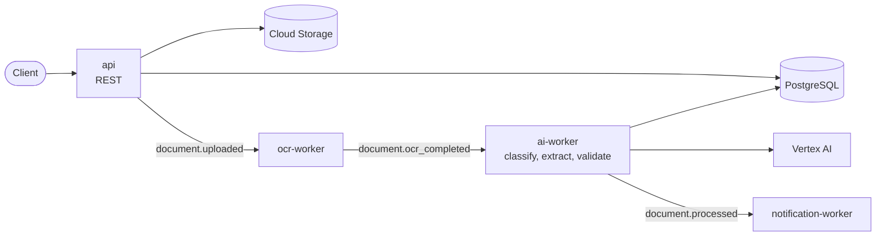

# DocFlow AI

**Cloud-native, event-driven document intelligence on Google Cloud.**

DocFlow AI accepts business documents such as invoices, processes them asynchronously through OCR and AI-based classification and extraction, validates the extracted fields against confidence thresholds, and exposes structured results through a REST API. It is built in Go, runs on GKE, and is provisioned with Terraform.

> 🚧 **Under active development.** The project is built in phases, and each phase is documented and its decisions recorded. **Done so far: the REST API with health probes, graceful shutdown, structured logging and document upload. Processing is simulated in-process.** See the [roadmap](#roadmap).

## Architecture



- **Asynchronous by design.** Uploads return `202 Accepted` immediately, and processing happens in independently scaling workers connected by Pub/Sub.
- **Reliable messaging.** A transactional outbox, idempotent consumers, retries with backoff and dead-letter topics.
- **Replaceable dependencies.** Storage, messaging and AI sit behind small interfaces, so the same code runs locally against a filesystem, emulators and a mock model.
- **Confidence-aware results.** Every extracted field carries a confidence score, and documents below the threshold are routed to `REVIEW_REQUIRED`.

Full details: [docs/architecture.md](docs/architecture.md).

## Technology

| Area | Technology |
|---|---|
| Language | Go 1.27 |
| API | REST + JSON, OpenAPI |
| Messaging | Google Cloud Pub/Sub |
| Data | PostgreSQL (Cloud SQL), Cloud Storage |
| AI | Vertex AI |
| Runtime | Docker, Kubernetes (GKE), Helm |
| Infrastructure | Terraform |
| Observability | OpenTelemetry, Cloud Logging, Cloud Monitoring |
| CI/CD | GitHub Actions |

## Quick start

Prerequisites: Go 1.27+, Docker, GNU make, golangci-lint. See [local development](docs/local-development.md) for setup, including on Windows.

```sh
git clone https://github.com/itzikyis/docflow-ai.git
cd docflow-ai

make check    # vet, lint, test
make run      # API on http://localhost:8080
```

Then, in another terminal (on Windows use `curl.exe`):

```sh
curl -i -F "file=@invoice.pdf" http://localhost:8080/documents
# HTTP/1.1 202 Accepted
# Location: /documents/0192f7b4-9a3c-7d2e-8f41-3b6c5d7e8f90
# {"id":"0192f7b4-...","status":"UPLOADED","statusUrl":"/documents/0192f7b4-.../status"}

curl http://localhost:8080/documents/<id>/status
# {"id":"0192f7b4-...","status":"PROCESSING","updatedAt":"2026-10-09T15:17:49Z"}
```

Errors are [RFC 9457](https://www.rfc-editor.org/rfc/rfc9457) problem documents:

```json
{"type":"about:blank","title":"Unsupported Media Type","status":415,
 "detail":"unsupported document type; accepted types are PDF, PNG and JPEG",
 "instance":"/documents","requestId":"4FZOGA4YCNQBOOOZMHRMSRXJE4"}
```

The full contract is in [api/openapi.yaml](api/openapi.yaml). `make docker` builds container images and `make up` runs the stack with Docker Compose.

## Roadmap

| Phase | Scope | Status |
|---|---|---|
| 0 | Architecture, repository, tooling, ADRs | ✅ |
| 1 | Go REST API, health checks, middleware, graceful shutdown, CI | ✅ |
| 2 | PostgreSQL: schema, migrations, repositories | ⏳ |
| 3 | Object storage abstraction and Cloud Storage | |
| 4 | Pub/Sub, event contracts, transactional outbox | |
| 5 | Worker framework and OCR worker | |
| 6 | AI classification and extraction with confidence scores | |
| 7 | Terraform infrastructure | |
| 8 | GKE deployment | |
| 9 | Helm charts per environment | |
| 10 | Observability: logs, metrics, traces | |
| 11 | Autoscaling on queue backlog | |
| 12 | Security hardening and threat model | |
| 13 | Full CI/CD pipeline | |
| 14 | Production-readiness review | |

## Documentation

- [Architecture](docs/architecture.md): components, flows, state machine, event contracts
- [Local development](docs/local-development.md): setup and everyday commands
- [Architecture Decision Records](docs/adr/README.md): why each major choice was made, and what was rejected

## Repository layout

```text
cmd/api/             API entry point (wiring only)
internal/config/     environment configuration
internal/logging/    structured logging, request-scoped log attributes
internal/document/   domain: document, status state machine, service
internal/httpapi/    HTTP server, middleware, handlers, errors
api/openapi.yaml     REST contract
docs/                architecture, guides, ADRs
Dockerfile           one multi-stage build for every service
Makefile             build, test, lint, docker targets
```

More directories (`migrations/`, `deploy/`, `terraform/`, ...) are added in the phases that introduce them.
