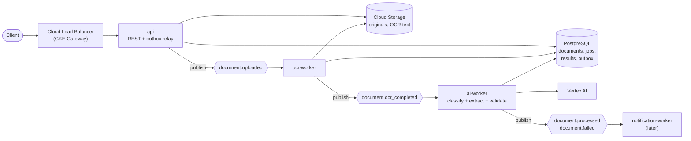
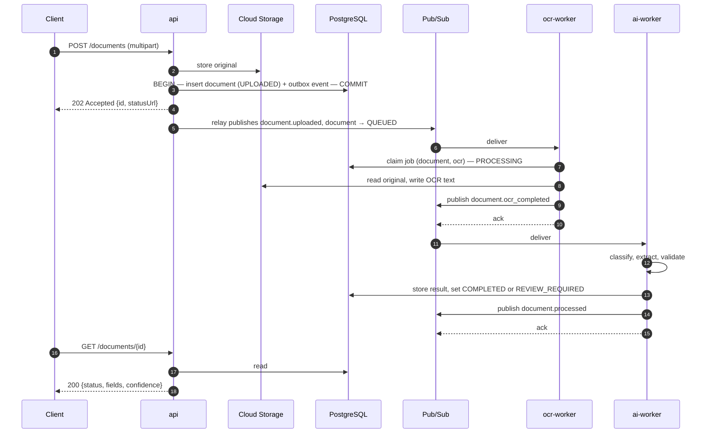
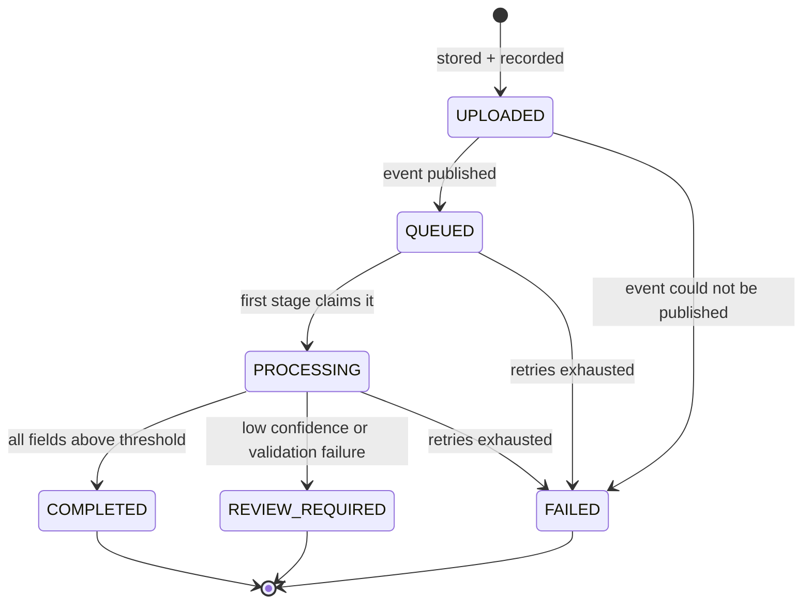

# Architecture

DocFlow AI is an event-driven document processing platform. Clients upload business documents such as invoices. The system stores each document, processes it asynchronously through OCR and AI-based classification and extraction, validates the result, and exposes it through a REST API.

> **Status:** this document describes the **target architecture**. It is built phase by phase; the [roadmap](#roadmap) shows what exists today. Significant decisions are recorded in [ADRs](adr/README.md).

## System overview



Every Pub/Sub subscription has a retry policy and a dead-letter topic (not drawn).

## Components

| Component | Responsibility | Scales on |
|---|---|---|
| **api** | Accepts uploads, validates them, stores originals, records documents, serves status and results. Runs the outbox relay that publishes pending events. | HTTP request rate / CPU |
| **ocr-worker** | Consumes `document.uploaded`, extracts text, stores it in Cloud Storage, emits `document.ocr_completed`. | Subscription backlog |
| **ai-worker** | Consumes `document.ocr_completed`, classifies the document, extracts fields with confidence scores, validates them, sets the final status, emits `document.processed` or `document.failed`. | Subscription backlog, bounded by AI quota |
| **notification-worker** | *(Later.)* Reacts to final events and notifies interested parties. Never blocks processing. | Subscription backlog |
| **PostgreSQL** | System of record: documents, processing jobs, extraction results, outbox. | Vertical |
| **Cloud Storage** | Original files and intermediate artifacts. Events carry references, never contents. | Managed |
| **Pub/Sub** | Durable, at-least-once delivery between stages, with fan-out. | Managed |

Why the workers are split this way is explained in [ADR-0005](adr/0005-worker-decomposition-by-stage.md).

## Processing flow



The upload response returns **before** processing starts. [ADR-0002](adr/0002-asynchronous-event-driven-processing.md) explains why.

## Document lifecycle



Transitions are enforced by the domain layer (`internal/document`), not only stored as a column value. An illegal transition is an error. This also stops a late, duplicate message from moving a finished document backwards.

## Event contracts

All events share one envelope. The envelope `version` lets consumers handle old and new payloads during rolling deployments.

```json
{
  "eventId": "7f1c9a4e-0b8e-4c1e-9d0a-2b7f3c1d5e6a",
  "eventType": "document.uploaded",
  "version": 1,
  "occurredAt": "2026-09-27T10:00:00Z",
  "correlationId": "req-01J8Z3...",
  "data": {
    "documentId": "3b0c5c1e-...",
    "storagePath": "documents/3b0c5c1e-.../original.pdf",
    "contentType": "application/pdf"
  }
}
```

| Event | Producer | Consumers |
|---|---|---|
| `document.uploaded` | api (via outbox) | ocr-worker |
| `document.ocr_completed` | ocr-worker | ai-worker |
| `document.processed` | ai-worker | notification-worker |
| `document.failed` | ocr-worker, ai-worker | notification-worker |

The W3C trace context (`traceparent`) travels in the Pub/Sub message **attributes**, not the payload, so distributed traces continue across the queue.

## Reliability properties

| Concern | Approach | Phase |
|---|---|---|
| Database write succeeds but publish fails | Transactional outbox: the event is written in the same transaction as the state change, and a relay publishes it | 4 |
| Duplicate delivery (Pub/Sub is at-least-once) | One job record per `(document_id, stage)`; completed work is acknowledged without being reprocessed | 4–5 |
| Transient failures | Pub/Sub retry policy with exponential backoff | 4 |
| Poison messages | Dead-letter topic per subscription after N attempts; the document is marked `FAILED` | 4 |
| Pod shutdown mid-processing | Graceful shutdown: stop pulling, finish in-flight work within the grace period; unacknowledged messages are redelivered | 1, 5 |
| Slow or failing AI provider | Timeouts, bounded concurrency per worker, retries through Pub/Sub rather than in-process loops | 6 |
| Losing track of a document | Correlation ID in every log line and event; distributed tracing | 1, 4, 10 |

## Local and cloud environments

Business logic depends on small interfaces, not on GCP SDKs, so the same code runs against local stand-ins.

| Concern | Local (docker compose) | Google Cloud |
|---|---|---|
| Runtime | Docker Compose | GKE |
| Database | `postgres` container | Cloud SQL for PostgreSQL |
| Object storage | Local filesystem implementation | Cloud Storage |
| Messaging | Pub/Sub emulator | Pub/Sub |
| AI | Deterministic mock | Vertex AI |
| Secrets | `.env` file (git-ignored) | Secret Manager |

## Repository layout

```text
cmd/            one directory per deployable binary (api, ocr-worker, ai-worker)
internal/       application code, organised by responsibility
api/            OpenAPI contract
migrations/     versioned SQL migrations
deploy/         Kubernetes manifests and Helm charts
terraform/      GCP infrastructure
docs/           architecture, guides and ADRs
tests/e2e/      black-box end-to-end tests
```

Directories are added in the phase that first needs them. Unit and integration tests live next to the code they test, following Go convention.

### Packages

| Package | Responsibility | Depends on |
|---|---|---|
| `cmd/api` | Wiring only: load config, build dependencies, run the server | everything below |
| `internal/config` | Environment variables to a validated `Config` | — |
| `internal/logging` | `slog` setup (Cloud Logging field names) and request-scoped log attributes carried in `context.Context` | — |
| `internal/document` | Domain: `Document`, status state machine, `Service`, `Repository` and `Dispatcher` interfaces | `logging` |
| `internal/httpapi` | HTTP adapter: server lifecycle, routes, middleware, handlers, RFC 9457 errors | `document`, `logging` |

Dependencies point inwards: `document` knows nothing about HTTP, so the workers in later phases reuse it without pulling in web code. Interfaces are declared by the package that *uses* them (`document.Repository`, `document.Dispatcher`), which is the idiomatic Go direction.

### HTTP request path

```text
withRequestID → accessLog → recoverPanics → ServeMux → handler
```

The request ID is assigned first, so every later log line, including the access log and any panic, carries it. Recovery is innermost so the access log records the resulting 500.

## Roadmap

| Phase | Scope | Status |
|---|---|---|
| 0 | Architecture, repository, tooling, ADRs | ✅ Done |
| 1 | Go REST API: health and readiness, middleware, graceful shutdown, basic CI | ✅ Done |
| 2 | PostgreSQL: schema, migrations, repositories | Planned |
| 3 | Object storage behind an interface; Cloud Storage | Planned |
| 4 | Pub/Sub, event contracts, transactional outbox, dead-lettering | Planned |
| 5 | Worker framework and `ocr-worker` (OCR mocked) | Planned |
| 6 | `ai-worker`: classification, extraction, confidence, validation | Planned |
| 7 | Terraform: GCP infrastructure | Planned |
| 8 | Deployment to GKE with Kubernetes manifests | Planned |
| 9 | Helm charts for dev, staging and production | Planned |
| 10 | Observability: OpenTelemetry logs, metrics, traces, dashboards | Planned |
| 11 | Autoscaling on Pub/Sub backlog | Planned |
| 12 | Security: authentication, rate limiting, threat model | Planned |
| 13 | Full CI/CD: image build, scanning, deployment | Planned |
| 14 | Production-readiness review | Planned |

Phases 1–6 together form the **MVP**: the complete pipeline running locally with `docker compose`, with AI mocked. Cloud infrastructure follows only after the architecture is proven locally.
